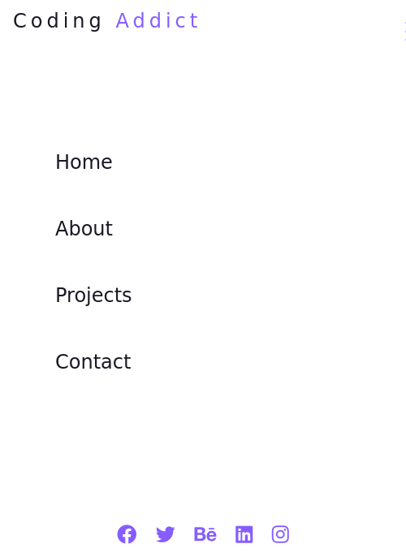
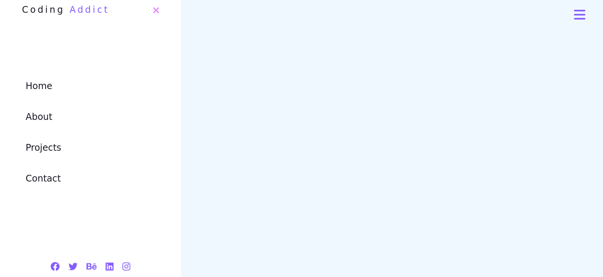

# Responsive Sidebar

Sidebar component that can be toggled on and off on desktop layouts.

## Screenshots

## Installation

1. Clone the repository `git clone https://github.com/AlexdelCarmen/responsive-sidebar`
2. Open `index.html` in your browser. 

## Features

- Sidebar reacts to display width and will automatically display buttons when viewed on wider screens.  
- On narrower viewports the navbar will hide interactive buttons and will take up the entire screen. 

## Technologies

- HTML
- CSS
- JavaScript

## License

This source code is licensed under the Unlicense.  View the [LICENSE](./LICENSE) file for details.

## Credits

- Inspired in John Smilga's prokects from this [video](https://youtu.be/3PHXvlpOkf4).

- Coded by [Alejandro Borges](https://github.com/AlexdelCarmen/responsive-sidebar)